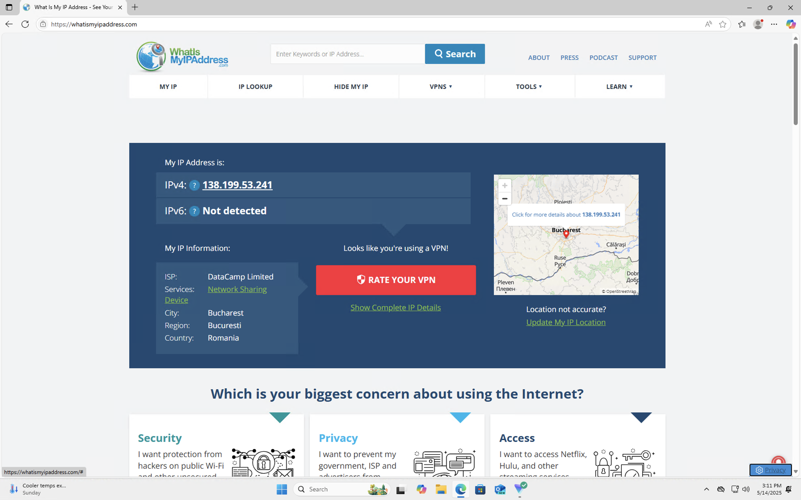
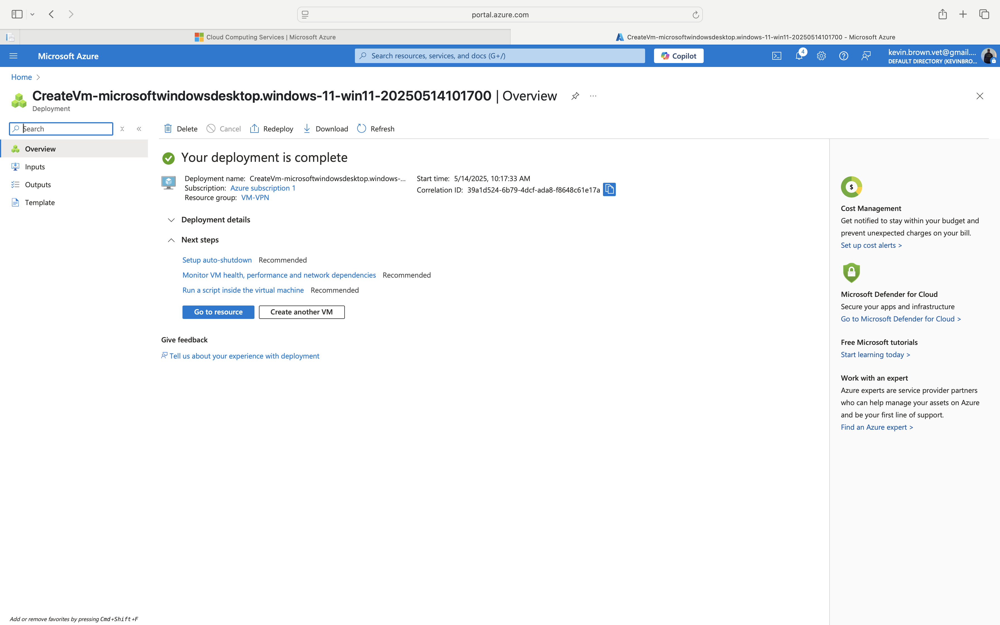
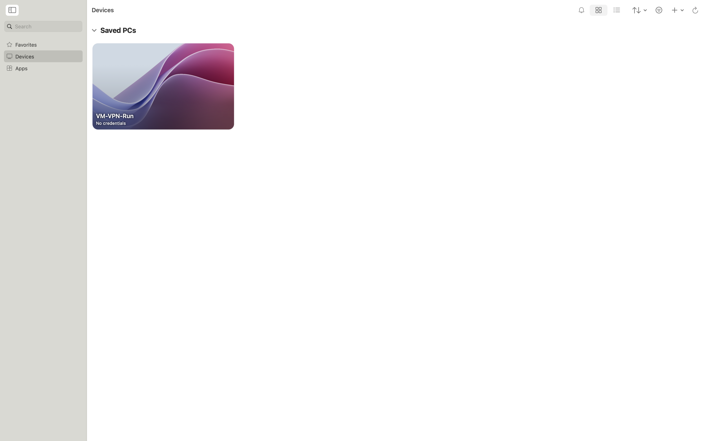
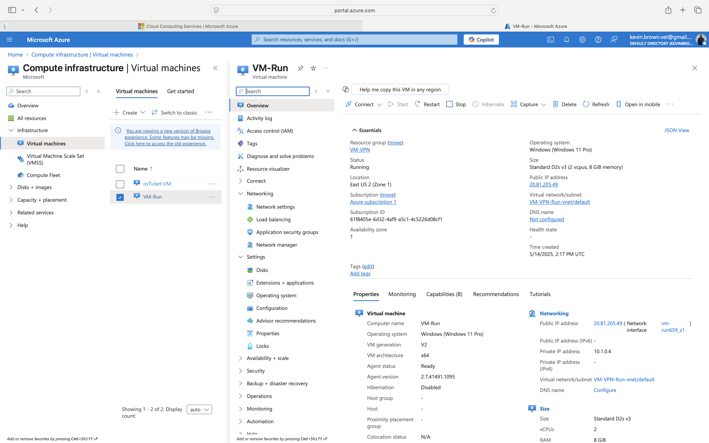
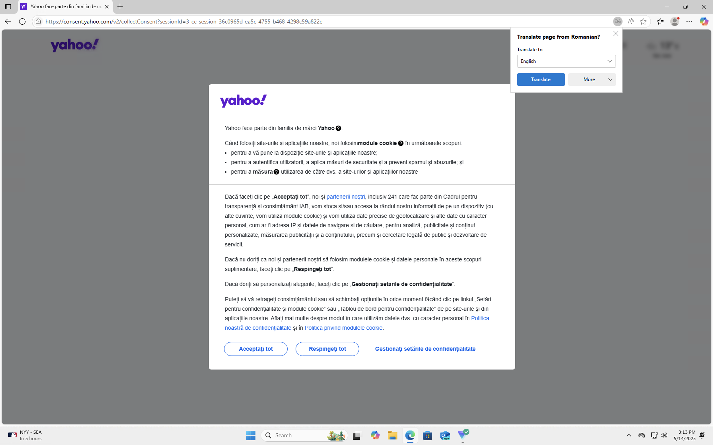
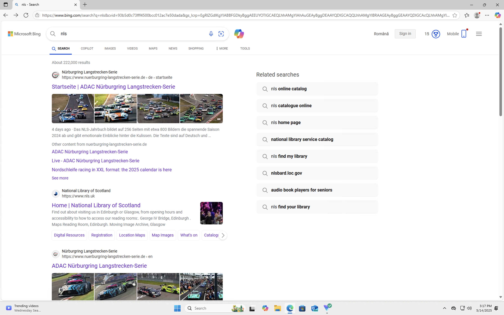

# 📘 VPN Setup & Usage

This project demonstrates how to set up and validate a VPN connection using **ProtonVPN**, along with securely routing traffic from a **virtual machine (VM)** in Microsoft Azure. This hands-on walkthrough is ideal for aspiring IT professionals and cybersecurity learners building foundational network and cloud security knowledge.

---

## 📂 Project Structure

---

## 🛠️ Setup Instructions

### 1. Install ProtonVPN
- Download and install the ProtonVPN desktop client.
- Log in using your Proton credentials.
- 

### 2. Connect to a VPN Server
- Choose a server (e.g., `RO-FREE#5` for Romania) and connect using the WireGuard protocol.
- Monitor status and traffic logs.
- 

---

## 🌐 IP Address Validation

### 3. Check IP Without VPN
- Before connecting to VPN, visit [whatismyipaddress.com](https://whatismyipaddress.com).
- Confirm your public IP and location.
- 

### 4. Check IP With VPN
- After connecting to ProtonVPN, visit the site again.
- Confirm that your public IP and location now reflect the VPN tunnel.
- 

---

## ☁️ VPN Integration with Azure Virtual Machine

### 5. Deploy VM in Azure
- Use Azure Portal to create a Windows 11 VM.
- Configure networking, region, authentication, and security groups.
- 
- 

### 6. Run ProtonVPN from the VM
- Connect to the VM using Remote Desktop.
- Install and launch ProtonVPN inside the VM.
- Verify VPN tunneling by checking the public IP.
- 
- 
- 
- 

---

## 🧠 Learning Outcomes

By completing this project, you will:

- ✅ Understand how VPNs mask IP addresses and encrypt traffic
- ✅ Learn to verify VPN connections with public tools
- ✅ Integrate VPN security into cloud environments (Azure VMs)
- ✅ Gain experience with remote desktop, virtual networking, and DNS/IP masking
- ✅ Strengthen hands-on IT lab documentation for your cybersecurity portfolio

---

## 🛠️ Troubleshooting Tips

| Problem | Solution |
|--------|----------|
| **Images not displaying in README** | Ensure filenames and paths are case-sensitive and correctly referenced. Use raw URLs if needed. |
| **VPN not connecting** | Try switching from WireGuard to OpenVPN or connecting to another free server. Restart the client. |
| **No IP change detected** | Make sure the VPN is active and that DNS leaks are not occurring (test with [dnsleaktest.com](https://dnsleaktest.com)). |
| **Azure VM can’t browse with VPN** | Ensure outbound internet is enabled via NSG (Network Security Group) rules, and that ProtonVPN is installed within the VM, not just the host. |
| **Remote Desktop not connecting** | Verify that the correct port (TCP 3389) is open in your Azure VM's firewall and NSG settings. |

---

## ✅ Summary

This project showcases how to implement, validate, and troubleshoot VPN usage both locally and in a cloud-based virtual machine. It reflects critical skills for IT support, system administration, and cybersecurity fundamentals.

---

## 📬 Contact

Feel free to [connect with me](https://www.linkedin.com/in/yourlinkedin) or open an issue if you’d like to suggest improvements or collaborate on projects!

